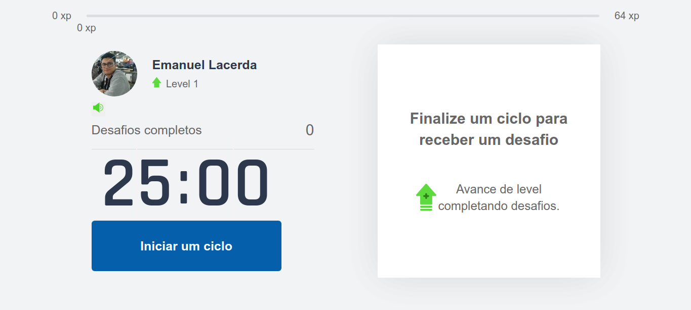
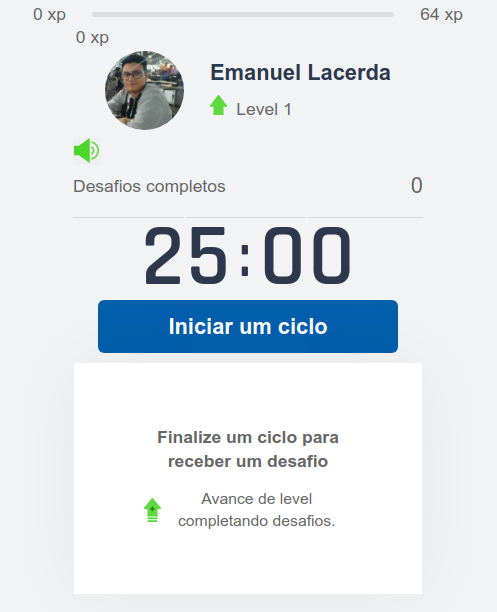
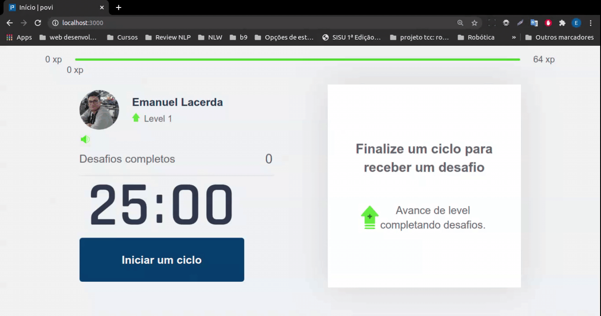
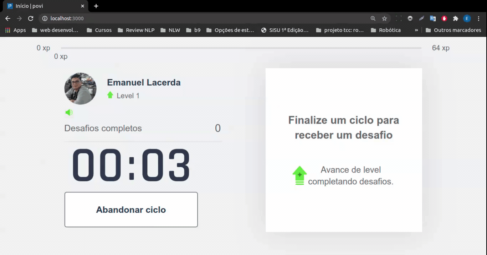
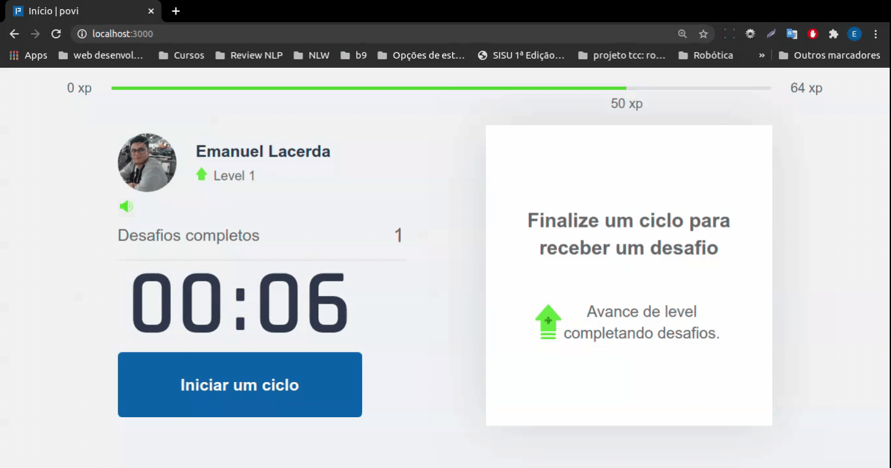
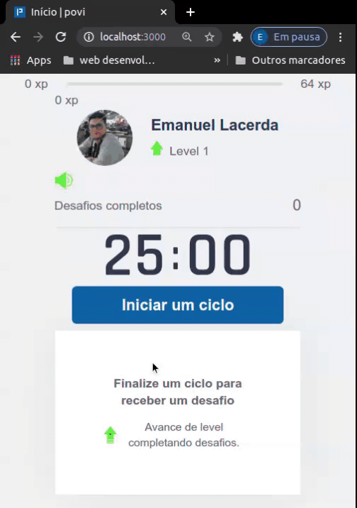
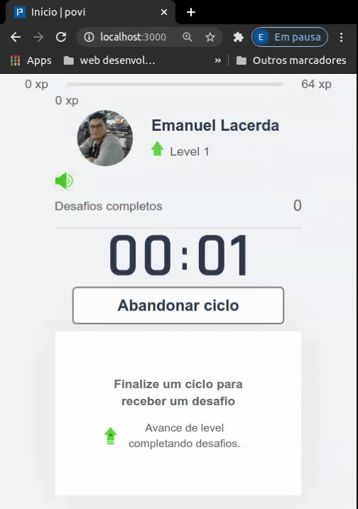
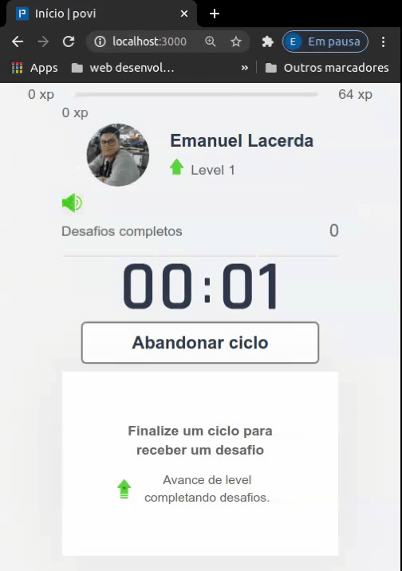

<h1 align="center">
    
</h1>

<p align="center" >
<a href="#Tecnologias">Tecnologias</a>
&nbsp;&nbsp;&nbsp;|&nbsp;&nbsp;&nbsp;
<a href="#Funcionalidades">Funcionalidades</a> &nbsp;&nbsp;&nbsp;|&nbsp;&nbsp;&nbsp;
<a href="#Deploy e demonstração">Deploy e demonstração</a> &nbsp;&nbsp;&nbsp;|&nbsp;&nbsp;&nbsp;
<a href="#Executando a aplicação">Executando a aplicação</a> &nbsp;&nbsp;&nbsp;|&nbsp;&nbsp;&nbsp;
<a href="#Licença">Licença</a>
</p>


O povi é uma aplicação de produtividade que uni a técnica de Pomodoro com exercícios para o corpo e para os olhos.

A técnica de Pomodoro consiste em ciclos com foco total na atividade que está sendo executada intercalados com período de descanso.

Ao fim de cada ciclo são realizados os exercícios citados acima. O objetivo desses exercícios é garantir que no período que o usuário estar sentado em frente ao computador ele realize alguma movimentação. Isso é importante para evitar que o usuário tenha problemas de saúde por estar longos períodos de tempo sem realizar nenhuma movimentação.

Com o objetivo de motivar o usuário a realizar os exercícios, foi incorporado gameficação na aplicação por meio de uma barra de experiência e level que evoluem conforme o usuário completa os desafios e de um histórico de desafios completados.


<h1 align="center">
    
</h1>


<h1 align="center">
    
</h1>


# Tecnologias


- [React.js](https://reactjs.org) e hooks [useState](https://reactjs.org/docs/hooks-state.html#gatsby-focus-wrapper), [useEffect](https://reactjs.org/docs/hooks-effect.html) e useContext.
- [Typescript](https://www.typescriptlang.org/).
- [Next.js](https://nextjs.org/).
- [js-cookie](https://github.com/js-cookie/js-cookie).


# Funcionalidades


- Iniciar um ciclo de 25 minutos.
- Abandonar um ciclo.
- Propostas de desafios para exercitar o corpo e os olhos ao fim de cada ciclo.
- Ganhar experiência e subir de level completando os desafios.
- Controlar se o som das notificações estará ativo ou mutado.
- Notificação informando que faltam 10 minutos para o fim do ciclo.
- Notificação informando que faltam 5 minutos para o fim do ciclo.


# Deploy e demonstração

Para realizar o deploy da aplicação [clique aqui](https://povi.vercel.app/).


## Desktop

### Iniciando um ciclo

<h1 align="center">
    
</h1>


### Abandonando um ciclo

<h1 align="center">
    
</h1>


### Completando um desafio

<h1 align="center">
    
</h1>


### Falhando em um desafio

<h1 align="center">
    
</h1>


### Subindo de level

<h1 align="center">
    
</h1>


### Controlando o som das notificações

<h1 align="center">
    
</h1>


## Mobile

### Iniciando um ciclo

<h1 align="center">
    
</h1>


### Abandonando um ciclo

<h1 align="center">
    
</h1>


### Completando um desafio

<h1 align="center">
    
</h1>


### Falhando em um desafio

<h1 align="center">
    
</h1>


### Subindo de level

<h1 align="center">
    
</h1>


### Controlando o som das notificações

<h1 align="center">
    
</h1>


# Executando a aplicação

```bash
# Clone esse repositório
$ git clone https://github.com/EmanuelLacerda/povi.git

# Acesse a pasta no projeto
$ cd povi

# Instale as dependências
$ npm install
# or
$ npm install -g yarn

# Execute a aplicação em modo desenvolvedor
$ npm run dev
# or
$ yarn dev

# A porta do servidor irá abrir no console: https://localhost:3000
```


# Licença

Esse projeto está sob a licença MIT. Veja o arquivo [LICENSE](https://github.com/EmanuelLacerda/nome-do-repositorio/blob/main/LICENSE) para mais detalhes.

------

Projeto desenvolvido por **[Emanuel de Souza Lacerda](https://github.com/EmanuelLacerda/)**

